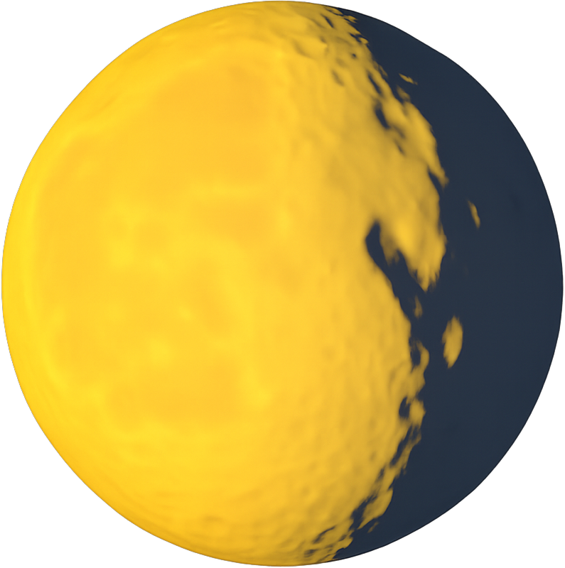

  

 

  <nav>
    <a href="/">Home</a>&nbsp;&nbsp;
    <a href="/pricing.md">Pricing</a>&nbsp;&nbsp;
    <a href="/docs/">Docs</a>&nbsp;&nbsp;
    <a href="/careers/">Careers</a>
  </nav>

# Lunal - The Confidential Compute Company

Lunal is software for secure, private, verifiable AI.

Built with Trusted Execution Environments (TEEs) and Zero-knowledge Cryptography (ZK), Lunal secures model weights and agents, delivers end-to-end private inference and training, and provides model data provenance.

Ready to get started or curious? [Say hi](mailto:ansgar@lunal.dev) and join us for a hot cup of TEE. 🫖

## Latest News

- 📣 [Blog - Secure AI Needs TEEs](/blog/secure-ai-needs-tees.md)
- 📣 [Partnership with Vail to Fingerprint and Verify AI Models](/blog/vail-partnership.md)
- 📣 [Partnership with Lucid for AI Location Verification](/blog/lucid-partnership.md)
- 📣 [Partnership with Impulse AI for Private Training, Fine-Tuning, and Inference](/blog/impulse-ai-partnership.md)
- 📣 [Partnership with Reppo for Confidential AI](/blog/reppo-partnership.md)
- 📣 [Partnership with Nexus for zkVM Privacy](/blog/nexus-partnership.md)

## Why Lunal?

TEEs provide a never-possible-before combination of privacy, security, verifiability, and performance. For the first time ever, you can now compute on encrypted data with end-to-end verification of the running software. Including AI inference. But TEEs are tricky.

First, privacy doesn't stop at the TEE: all surrounding software and systems must also preserve privacy. And to be verifiable, everything in TEEs must be measurable, attestable, and reproducible.

Getting this right is hard. Getting it right at scale, with best-in-class security and zero downtime? Even harder. That's why we built Lunal: unified software and infrastructure that make TEEs simple, usable, and scalable.

Here are problems Lunal solves that make using TEEs easier:

### Key Features

- **Unified CPU & Accelerators:** Combined CPU and GPU TEEs so your software, models, and data stay private, secure, and verifiable.

- **Drop-in compatibility:** Deploy and scale your existing applications and AI workloads in TEEs as-is, with zero changes.

- **Seamless CI/CD:** Connect Lunal to your GitHub repo. On every commit, Lunal checks out your code, verifiably builds it, and deploys it.

- **End-to-end verifiability:** Lunal automatically staples a verifiable TEE attestation to every HTTP response in an HTTP response header. These attestations affirm the TEE is uncompromised and attest to all software inside - from the AI model loaded to the git commit of your code.

  You, and any third party, can independently verify these attestations. Attestations are signed by Intel, AMD, and/or NVIDIA.

- **Automatic scaling:** Global, automatic scaling based on CPU usage, GPU usage, memory pressure, and/or request/response latency. Scaling metrics are privately measured in the TEE with zero-knowledge proofs (ZKP).

- **Application services:** Privacy-preserving firewalls, DDoS protection, rate limiting, routing, load balancing, and caching. Lunal’s services run in TEEs themselves; Lunal can’t see any passthrough or cached data.

- **Security:** TEE keys are automatically rotated. Uploaded data can only be decrypted in Lunal TEEs. Hardened OS and language runtimes, reproducible builds, and policy-enforced further reduce the attack surface.

- **SDKs:** Client and server SDKs encrypt data for upload to Lunal and verify the TEE attestations in responses.

- **Logging:** All telemetry and logs are recorded privately in the TEE and encrypted with your public key; only you can read them.

👋 [Ansgar](https://github.com/gruns), [Amean](https://github.com/AmeanAsad), and the merry band of misfits at Lunal
