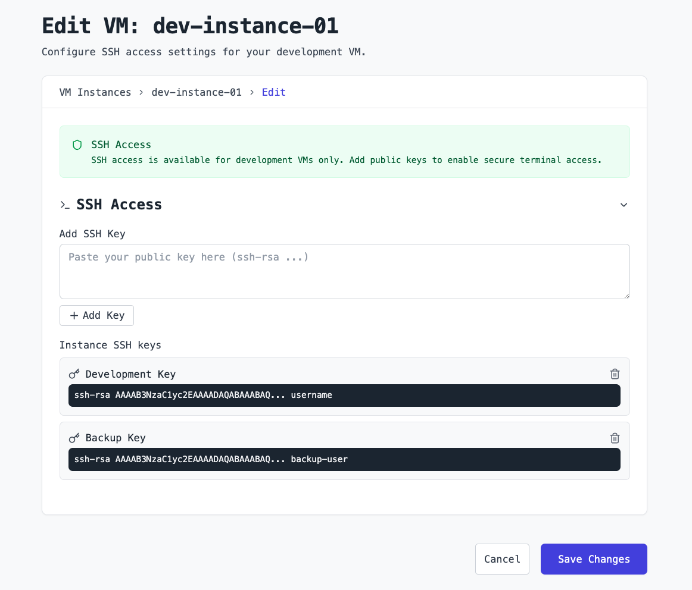

# Access Lunal VMs via SSH

<div align="center" style="margin: 2em 0;">
  <nav style="font-size: 1.5em; font-weight: 600;">
    <a href="/README.md" style="text-decoration: none; margin: 0 2em; color: #2563eb; transition: color 0.3s ease;">Home</a>
    <a href="/pricing.md" style="text-decoration: none; margin: 0 2em; color: #2563eb; transition: color 0.3s ease;">Pricing</a>
    <a href="/docs/README.md" style="text-decoration: none; margin: 0 2em; color: #2563eb; transition: color 0.3s ease;">Docs</a>
  </nav>
</div>

This page documents the process of securely configuring and connecting to a TEE-secured development VM on Lunal via SSH.

## Table of Contents

- [Access Lunal VMs via SSH](#access-lunal-vms-via-ssh)
  - [Table of Contents](#table-of-contents)
  - [Create SSH Keys](#create-ssh-keys)
  - [Add SSH Keys to a New VM](#add-ssh-keys-to-a-new-vm)
  - [Add SSH Keys to an Existing VM](#add-ssh-keys-to-an-existing-vm)
  - [Connect to Your VM](#connect-to-your-vm)

---

> **Note**: SSH access is only available for development VMs. Production VMs and code deployments do not support direct SSH access for security.

## Create SSH Keys

Lunal provides SSH access to your development VMs via SSH keys. SSH via passwords is disabled for security. You likely already have SSH keys on your machine. To check, open a terminal and run:

```bash
ls ~/.ssh
```

If you see files like `id_rsa` and `id_rsa.pub`, you already have a private:public key pair. You can reuse that key pair or create a new key pair specifically for Lunal by following the steps below.

1. Open a terminal on your local machine.
2. Run the following command to generate a new SSH key pair:

```bash
ssh-keygen -t rsa -f ~/.ssh/lunal
```

Two files will be generated:

- **Private key**: `~/.ssh/lunal` → Keep this secure.
- **Public key**: `~/.ssh/lunal.pub` → Add this to your VM below.

## Add SSH Keys to a New VM

When you create a new development VM, you can add your SSH keys in the "SSH Access" section of the Security menu. Simply paste the contents of your public key, like `~/.ssh/id_rsa.pub` or `~/.ssh/lunal.pub`, into "Add SSH Key" and save it before creating your VM instance.


The SSH key contents will be formatted like:

```
ssh-rsa AAAAB3NzaC1yc2EAAAA... user@host
```

## Add SSH Keys to an Existing VM

If you've already deployed a development VM, you can access the SSH key management interface from the VM details page. Simply navigate to your VM, click "Edit", and look for the "SSH Access" section where you can add, or remove, SSH keys as needed.



You can also manage SSH keys using the CLI with the following command:

```bash
lunal vm ssh-keys --vm-id YOUR_VM_ID --add ~/.ssh/id_rsa.pub
```

To remove a key:

```bash
lunal vm ssh-keys --vm-id YOUR_VM_ID --remove "user@host"
```

Where `user@host` is the label, or comment, of the SSH public key to remove.

## Connect to Your VM

Once you've added your SSH key to a VM, you can connect with:

```bash
ssh -i ~/.ssh/lunal user@VM_IP_ADDRESS
```

And replace:

- `user` with your username on the VM
- `VM_IP_ADDRESS` with your VM's public IP address, found on the VM details page

---

[← Back to Documentation](README.md)