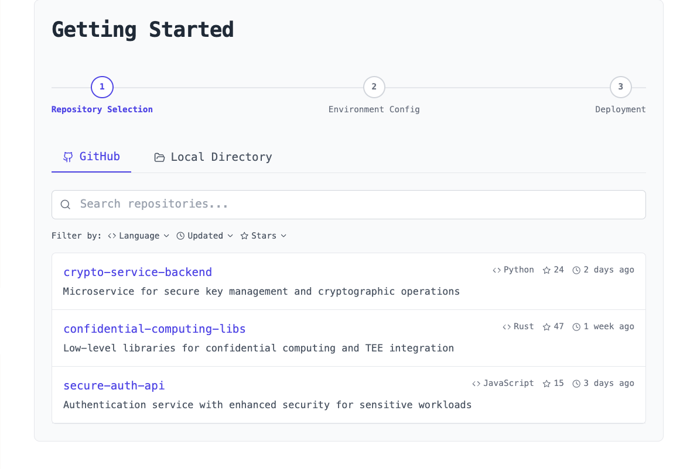
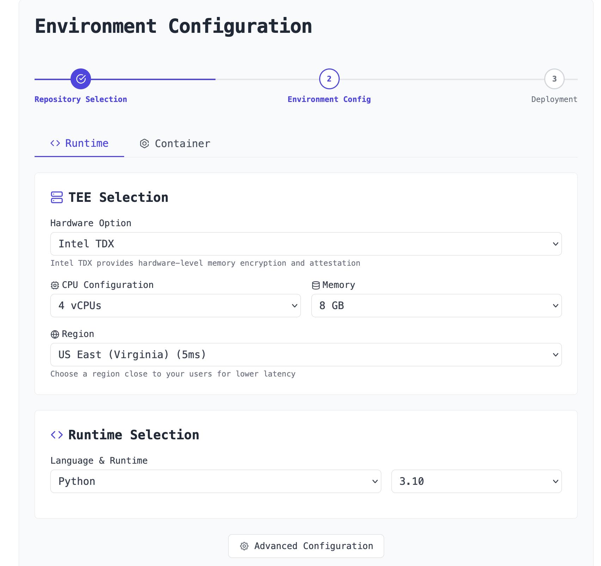
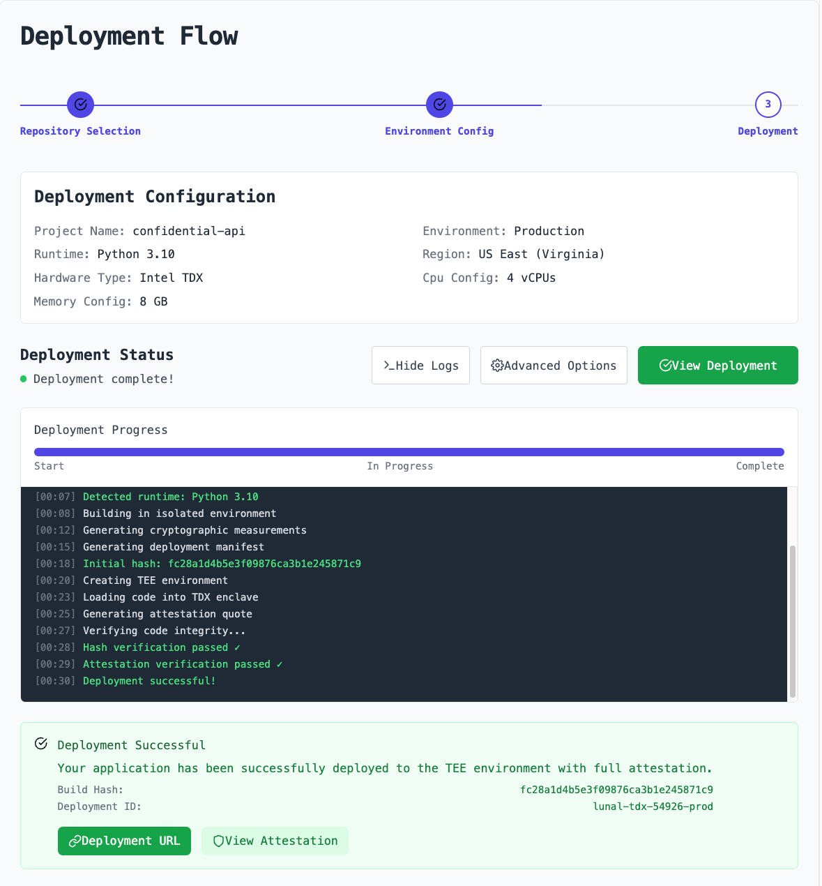
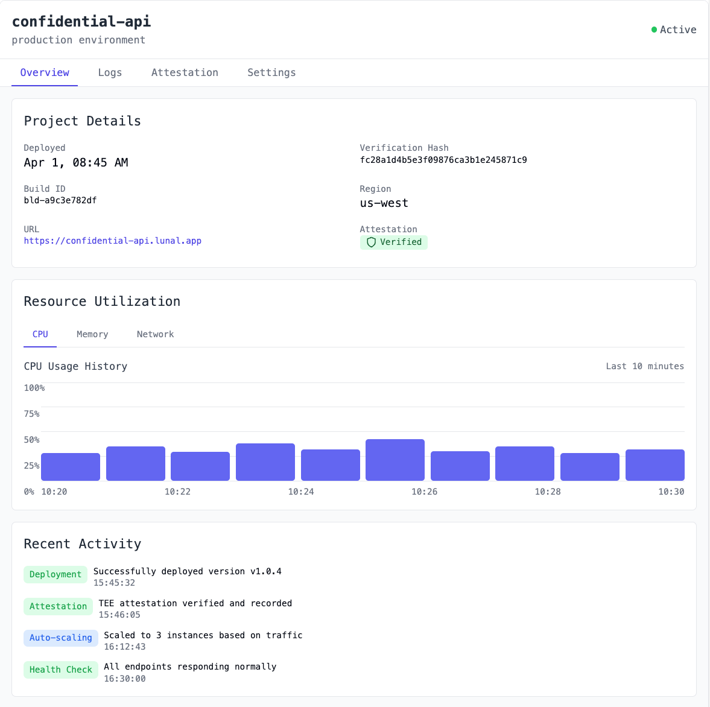
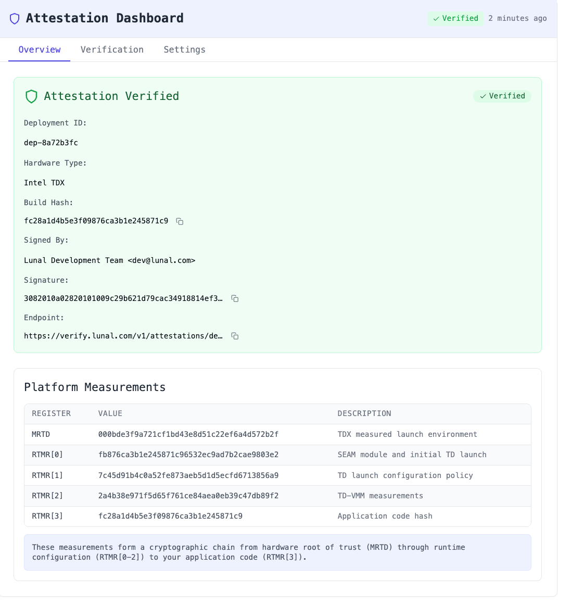
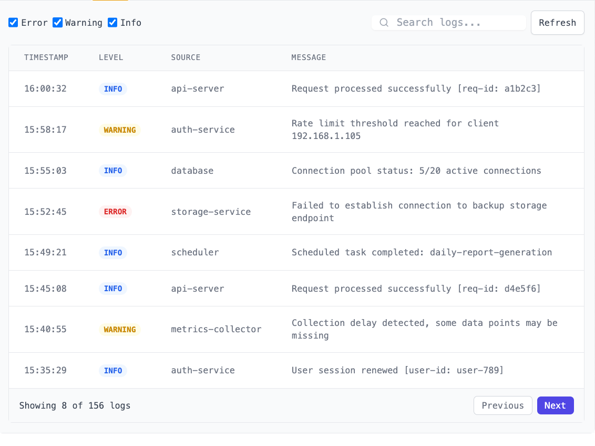

# Deploy TEE-secured Code on Lunal

<div align="center" style="margin: 2em 0;">
  <nav style="font-size: 1.5em; font-weight: 600;">
    <a href="/README.md" style="text-decoration: none; margin: 0 2em; color: #2563eb; transition: color 0.3s ease;">Home</a>
    <a href="/pricing.md" style="text-decoration: none; margin: 0 2em; color: #2563eb; transition: color 0.3s ease;">Pricing</a>
    <a href="/docs/README.md" style="text-decoration: none; margin: 0 2em; color: #2563eb; transition: color 0.3s ease;">Docs</a>
  </nav>
</div>

This page documents the process of deploying and scaling code secured in Trusted Execution Environments (TEEs) on Lunal.

This deployment is for you if you want Lunal to handle deploying, running, and scaling your code for you. If instead you want to run TEE-secured VMs on Lunal, for long-running services and/or development, see [Provision a VM](provision-a-vm.md).

## Table of Contents

- [Getting Started](#1-getting-started)
- [Project Configuration](#2-project-configuration)
- [Deployment Flow](#3-deployment-flow)
- [Autoscaling](#4-autoscaling)
- [Dashboard](#5-dashboard)
- [Attestation and Verification](#6-attestation-and-verification)
- [Logging & Performance Monitoring](#7-logging--performance-monitoring)

---

## 1. Getting Started

Lunal's goal is to make it as simple as possible to deploy, run, and scale your code securely in Trusted Execution Environments. To start, select your code's source through a simple interface. You can either connect your GitHub and select a repository or upload your codebase directly.



After selecting a repository or uploading your code, configure your project with a name, environment type (Development or Production), and select the branch you wish to deploy.

## 2. Project Configuration

### Hardware Selection

Select your desired Trusted Execution Environment hardware. We offer multiple memory and CPU configurations to match your application needs.



### Deployment Configuration

Choose between two deployment approaches: language runtime or containerized via Docker. The language runtime approach is ideal for language-specific applications where you need fine-grained control over your environment and optimized performance. The containerized approach provides maximum portability and dependency isolation, perfect for more complex applications.

Lunal automatically suggests the optimal configuration based on your repository contents. You can also explicitly define a runtime with a `lunal.config.yaml` file, like:

```yaml
runtime:
  language: python
  version: "3.10"
  framework: flask
  requirements: requirements.txt
```

## 3. Deployment Flow

Once your environment is configured, deploying is a straightforward process. Before deployment, you'll see a summary of your configuration and with one click, you can kick off the deployment process.



### Reproducible Builds & Hash Generation

Lunal builds your project in a reproducible manner to ensure that the same input code always produces the same output artifacts. The build process locks in your code, dependencies, kernel version, compiler toolchain, and build environment to guarantee reproducibility.

During the build process, cryptographic hashes are generated for your code and all dependencies. These hashes form a verifiable supply chain that ensures the integrity of your application. Reproducibility is broken if any dependency changes, if build parameters are modified, or if the source code is altered in any way - providing a strong guarantee that what's running is exactly what you intended.

### Deployment Confirmation

After successful deployment, you'll receive your deployment URL and attestation verification. Your URL will be the gateway to interact with your deployed application.

```bash
# Access your deployed application with a sample API call
$ curl https://{your-deployed-app-domain}/api/hello
{"message": "Hello from your secure Luna Lamp application!"}

# Check attestation status to verify your app is running in a trusted environment
$ lunal attestation status --app your-app-name
✅ Application "your-app-name" is running with valid attestation
Attestation Provider: Intel TDX
Last verified: 2 minutes ago
```

## 4. Autoscaling

Configure automatic scaling of your TEE-secured code, applications, and services based on performance and load metrics.

### Scaling Metrics

Scale your code, applications, and services with scaling rules based on:

- CPU utilization (eg scale out when above 70%, scale in when below 70%)
- Memory pressure (eg scale out when above 80%, scale in when below 80%)
- Response latency (eg scale out when p95 latency above 500ms, scale in when below 500ms)
- Request rate (eg scale out when above 1000 request per second (RPS), scale in when below 1000 RPS)

Each metric is aggregated in a rolling window of `rollingWindowSecs` seconds, eg 600 seconds for 5 minutes, before any scaling actions are triggered. Default is 300 seconds, or 5 minutes.

Example `lunal.config.yaml` with autoscaling:

```yaml
autoscaling:
  minInstances: 1
  maxInstances: 100
  regionScope: global # options: global or regional
  scalingActionCooldownSecs: 60 # cooldown between scaling actions
  regions: # required if [regionScope] is 'regional'
    - us-east-1
    - eu-west-1
  metrics:
    - type: cpuUtilizationPct
      target: 70
      rollingWindowSecs: 300 # 5 minute rolling window, optional
    - type: memoryUtilizationPct
      target: 80
    - type: responseLatencyMsP95
      targetMs: 500
    - type: requestsPerSecond
      target: 1000
      rollingWindowSecs: 60
```

### Scaling Behavior

Lunal automatically:

- Generates full TEE attestations with every new TEE created.
- Performs graceful TEE instance terminations.
- Implements cooldown periods between scaling actions.
- Implements sticky sessions based on a client's key and/or IP address.
  - Sticky sessions maintain client-server affinity to ensure that a client's requests are routed to the same instance for the duration of their session.
- Distributes instances based on your chosen region scope:
  - `global`: Scales out across all regions globally proportionally to their load. Best for low-latency applications that need a global presence close to users.
  - `regional`: Scales out only in the specified regions. Best when you don't need a global presence, closest to all users.

### Scaling Considerations

When configuring scaling thresholds:

- Consider your application's traffic patterns and resource usage.
- Be conservative with thresholds to avoid thrashing.
- Account for potential traffic spikes.
- Test scaling behavior in a staging environment first.

## 5. Dashboard

The Lunal dashboard provides a comprehensive view of all your deployed applications, their current status, and key metrics at a glance. Monitor deployment health, resource utilization, and access logs all from a single interface.



## 6. Attestation and Verification

Lunal provides cryptographic proof that your code is running exactly as intended, in a genuine TEE environment, without tampering or espionage. This process is referred to as "Attestation". We create a complete end-to-end verification flow that connects your original source code, your developer signature, the platform build hash, and the running application.

### Developer Signing Process

For additional security, you can sign your code using your personal or organizational cryptographic keys. This creates a verifiable link between you as the developer and the deployed code.

**Why sign:** When your code is built and deployed to a TEE, it's important to verify that the code running in production is exactly what you intended to deploy. By signing the hash of your application, you create a cryptographic guarantee that you've approved this specific version of the code. This prevents unauthorized modifications and establishes a clear chain of accountability.

The signing process works as follows:

1. Lunal generates a cryptographic hash of your application during the build process.
2. You receive this hash and independently verify it matches your expectations.
3. Using your private key, you sign this hash, creating a signature that only you could produce.
4. This signature is stored alongside your deployment and becomes part of the attestation record.

Now anyone with access to your public key can verify that you personally approved this specific version of the application, without needing access to your private key. This creates a strong guarantee that the code running in the TEE has your explicit approval.

```bash
# Sign your code's hash with your private key
lunal sign --hash-file hash.txt --key ~/.ssh/id_rsa

# Upload the signature to Lunal
lunal upload --signature hash.txt.sig --deployment your-app-name
```

### Attestation Dashboard

The attestation dashboard provides visibility into your deployment's security status, including:

- Build Hash verification
- Developer signatures
- Platform measurements that show the chain of trust



### Verification API

Lunal provides end-to-end attestation for both Intel TDX and AMD SEV. This allows you, or anyone, to attest and verify your deployments with your signature.

```bash
# Verify the attestation via CLI
lunal attestation verify --deployment your-app-name
```

#### Example API Response

```json
{
  "status": "verified",
  "attestation": {
    "id": "att_8f93jd82",
    "timestamp": "2023-09-15T14:32:19Z",
    "deployment_id": "your-app-name",
    "build_hash": "sha256:7a9d2e4cdf81b7d240ae091df166164f6589a444c25ce98649c9452f9fcc1234",
    "measurements": {
      "mr_enclave": "9a6743fc25ed8c83f48d9d453b5ccf8b6239c41ebeda4c5518e5fe33beb89f23",
      "mr_signer": "83d719e77deaca1470f6baf62a4d774303c899db69020f9c70ee1dfc08c7ce9e"
    },
    "signature_verification": {
      "developer_id": "dev_29fja92",
      "signature_valid": true,
      "key_id": "4f:23:98:71:e4:...:35:0a"
    },
    "platform_verification": {
      "tcb_status": "up_to_date",
      "qe_identity_status": "valid"
    }
  }
}
```

#### Example CLI Response

```
✅ Attestation verification complete for deployment: your-app-name

Deployment ID: your-app-name
Build Hash: sha256:7a9d2e4cdf81b7d240ae091df166164f6589a444c25ce98649c9452f9fcc1234
Verification Time: 2025-04-03 22:31:40 UTC

TEE Measurements:
  MR_ENCLAVE: e1b5a493b7f58a72e87e53e7d648edb5fd2801321fc87dd9c58f97c0d027d562
  MR_SIGNER: 6d4bfa5fbd1aa7791c2a75007c9b4f0b4136bb7b89a17bb9a23195c8a53c3690

Developer Signature: VALID ✓
  Developer: John Doe (dev_29fja92)
  Key Fingerprint: 4f:23:98:71:e4:...:35:0a

Platform Verification: SECURE ✓
  TCB Status: Up to date
  QE Identity: Valid
  Memory Encryption: Active
  Secure Boot: Verified

The deployment is running in a genuine TEE environment.
```

## 7. Logging & Performance Monitoring

### Logs Dashboard

Monitor your application through our centralized logging system with search and filter capabilities for quick debugging. Real-time log streaming helps you identify and resolve issues promptly.



### Performance Metrics

Track your application's performance with real-time resource utilization graphs, response time metrics, and automatic anomaly detection. Get insights into CPU, memory usage, network traffic, and other critical performance indicators.

### Encrypted Monitoring

For sensitive applications, our encrypted monitoring feature ensures maximum confidentiality of your application logs and performance data. All logs from within your deployed application can be encrypted using your public key.

This end-to-end encryption means that only you, with your private key, can decrypt and view the monitoring data. Even our platform administrators cannot access your sensitive log information, providing you with unparalleled security guarantees for compliance and privacy requirements.

### Alerting & Notifications

Set up custom alerts based on log patterns or performance thresholds to receive instant notifications when your application requires attention. Integrate with your preferred notification channels including email, Slack, and/or SMS.

---

[← Back to Documentation](README.md)