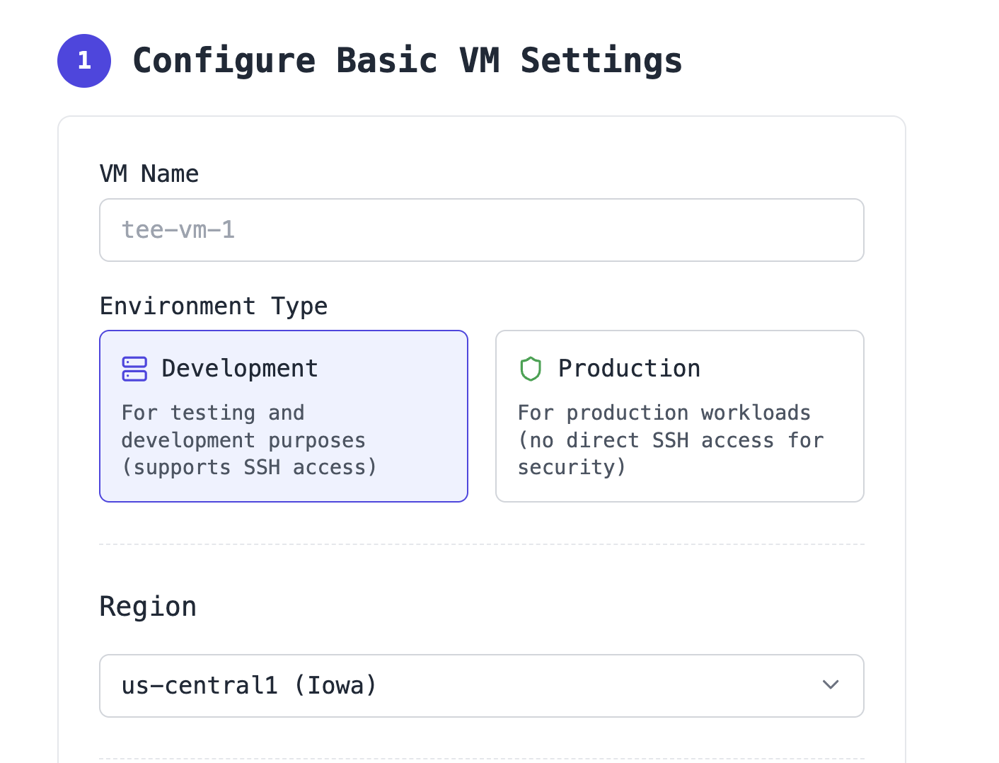
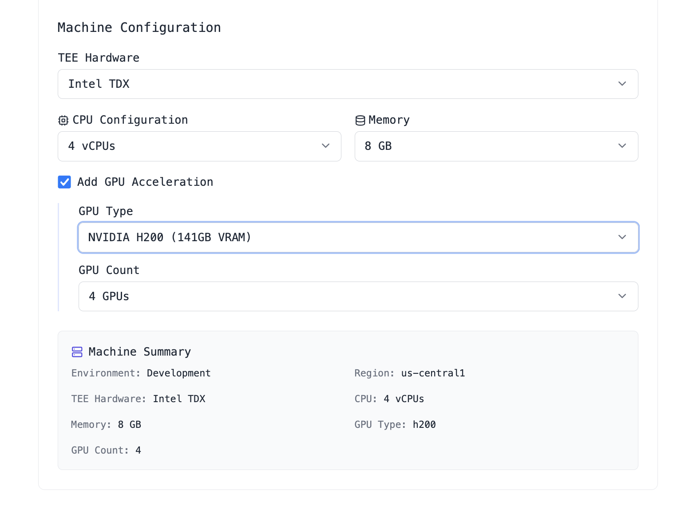
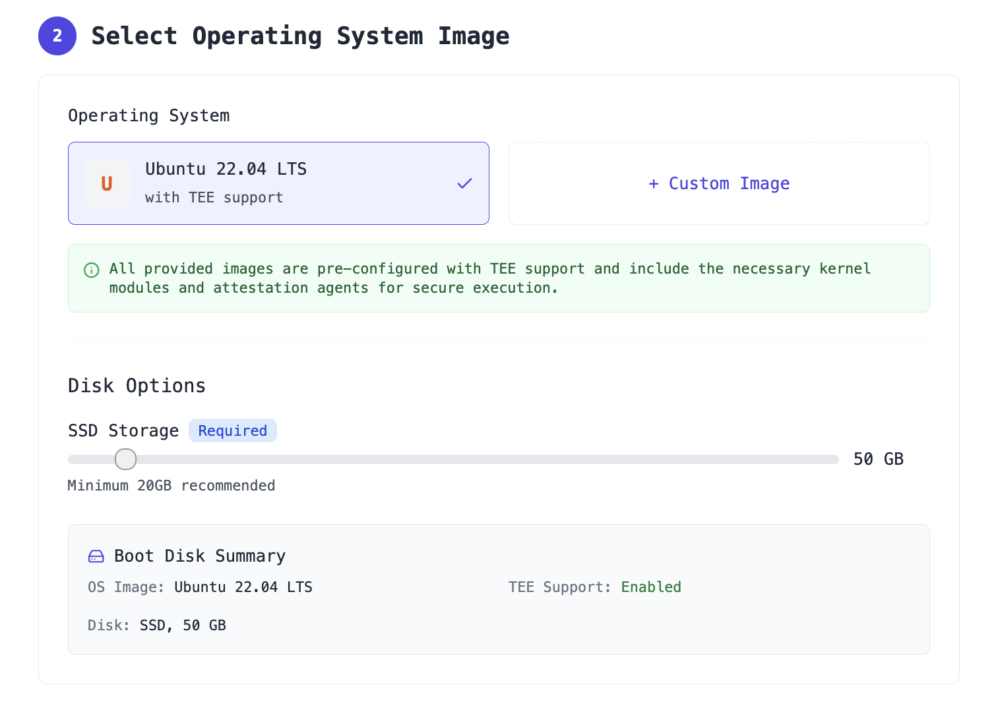
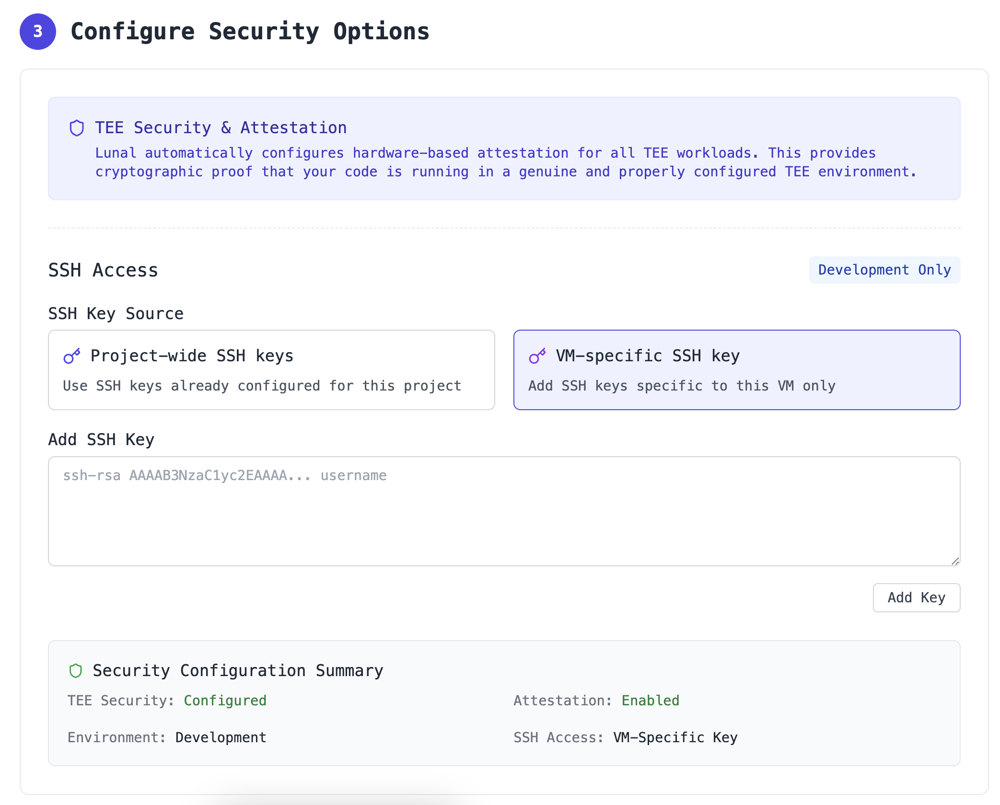
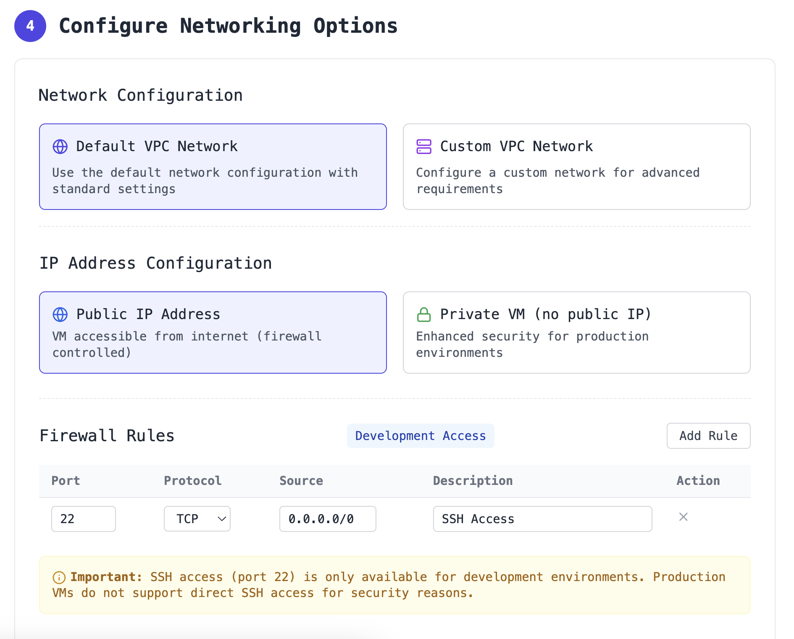
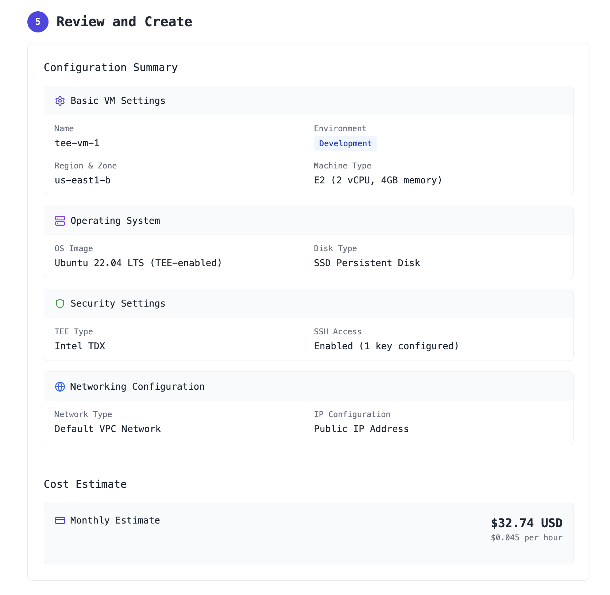
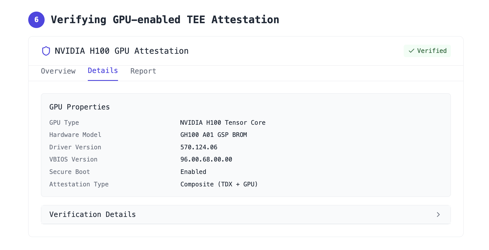

<div align="right">
  <nav>
    <a href="/">Home</a>&nbsp;&nbsp;
    <a href="/pricing.md">Pricing</a>&nbsp;&nbsp;
    <a href="/docs/">Docs</a>
  </nav>
</div>

# Launch a TEE-secured VM on Lunal

This page documents the process to launch a TEE-secured (Trusted Execution Environment) virtual machine on Lunal.

Use these VMs for development or long-running services in production. If instead you want Lunal to handle deploying, running, and scaling your code for you, see [Deploy Code](deploy-code.md).

## Table of Contents

- [Launch a TEE-secured VM on Lunal](#launch-a-tee-secured-vm-on-lunal)
  - [Table of Contents](#table-of-contents)
  - [1. Configure Basic VM Settings](#1-configure-basic-vm-settings)
    - [Name and Environment](#name-and-environment)
    - [Region and Zone](#region-and-zone)
    - [Machine Configuration](#machine-configuration)
  - [2. Select Operating System](#2-select-operating-system)
    - [Boot Disk](#boot-disk)
    - [Disk Size](#disk-size)
  - [3. Configure SSH](#3-configure-ssh)
  - [4. Configure Networking (Optional)](#4-configure-networking-optional)
  - [5. Review and Create VM](#5-review-and-create-vm)
  - [6. Verify TEE Attestation](#6-verify-tee-attestation)
    - [Verification API](#verification-api)
      - [Example CLI Response](#example-cli-response)
  - [7. Connect via SSH](#7-connect-via-ssh)

---

## 1. Configure Basic VM Settings

### Name and Environment

In the "Name and Environment" section, enter a descriptive name for your VM, like "tee-vm-1". Under "Environment Type", select either "Development" for testing and development purposes (which supports SSH access) or "Production" for production workloads (which do not support SSH access for security).

### Region and Zone

In the "Region and Zone" section, select your preferred geographic region from the dropdown. For development, any zone is typically sufficient.



### Machine Configuration

In the "Machine Configuration" section, you can select the type of supported TEE hardware. Lunal supports Intel TDX, AMD SEV, and NVIDIA Confidential Computing. Choose the number of vCPUs required and RAM. You can also provision TEE-secured GPUs as part of your dedicated machine, like H100s and H200s.



## 2. Select Operating System

### Boot Disk

In the "Boot Disk" section, by default, Ubuntu 22.04 LTS with TEE support is selected. If you need a different image, click the dropdown menu and select "Custom image". From the custom image panel, you can select from available images or import a new one.

### Disk Size

Choose an appropriate disk size for storage. All storage is SSD. Minimum 20GB recommended.



## 3. Configure SSH

> **Note**: SSH access is only available for development VMs. Production VMs and code deployments do not support direct SSH access for security.

For development VMs, configure SSH access in the "SSH Access" subsection (only visible for development VMs). Choose your SSH key source by selecting "Use project-wide SSH keys" if you've already added keys to your project, or select "Add SSH key to this VM only" to add keys only to this VM. Click "Add SSH Key" and paste in the contents of your public key. The contents will be formatted as such:

```
ssh-rsa AAAAB3NzaC1yc2EAAAA... user@host
```

Click "Add Key" to save the key.



## 4. Configure Networking (Optional)

You can keep the default "Default VPC network" or select a custom VPC. For enhanced security in production, consider enabling "Private VM (no public IP)" and configure VPN access separately. For development VMs requiring SSH access, ensure the firewall allows access to port 22.



## 5. Review and Create VM

Review all your VM settings and make any necessary adjustments. Note the estimated cost displayed at the bottom of the summary. This cost will be billed to your account's default credit card.

Click the blue "Create" button to provision your VM. You'll be taken to the VM details page where you can monitor the deployment progress. Once the status shows "Running" with a green indicator, your VM is ready.



## 6. Verify TEE Attestation

After your VM has been created, verify that the TEE is properly configured and attested. Navigate to the "VM instances" page and click on your VM name to view its details. In the "Security" tab, locate the "TEE Attestation" section. You should see "Verified" with a green checkmark. Click "Report" for detailed attestation information including hardware validation status, memory encryption verification, secure boot status, platform integrity measurements, and cryptographic proof details.



### Verification API

Lunal supports Intel TDX, AMD SEV, and NVIDIA Confidential Computing. This allows you to verify that your VM is running in a genuine TEE environment with the expected security properties.

```bash
# Verify the attestation via CLI
lunal attestation verify --vm-id your-vm-name
```

#### Example CLI Response

```
✅ Attestation verification complete for VM: your-vm-name

VM ID: your-vm-name
Verification Time: 2025-04-09 19:32:19 UTC

TEE Measurements:
  MR_ENCLAVE: 9a6743fc25ed8c83f48d9d453b5ccf8b6239c41ebeda4c5518e5fe33beb89f23
  MR_SIGNER: 83d719e77deaca1470f6baf62a4d774303c899db69020f9c70ee1dfc08c7ce9e

Platform Verification: SECURE ✓
  TCB Status: Up to date
  QE Identity: Valid
  Memory Encryption: Active
  Secure Boot: Verified

GPU Verification: SECURE ✓
  GPU Model: NVIDIA H200
  Confidential Compute: Enabled
  Driver Integrity: Verified
  Attested Runtime: Trusted

vTPM PCR Bindings:
  PCR[11] with GPU: e3a0d4c58c9f764ea0fd4268f5e8e531f1a52f7b66a42d7b429ea731b4a6f2cb

The VM is running in a genuine TEE environment.
```

## 7. Connect via SSH

> **Note**: SSH access is only available for development VMs. Production VMs and code deployments do not support direct SSH access for security.

If you created a development VM and configured SSH, you can now connect to it via SSH using the SSH key you configured earlier. Like:

```bash
ssh -i ~/.ssh/your_private_key username@vm-external-ip
```

For more detailed instructions on SSH access, including troubleshooting and advanced configurations, please refer to our [SSH Access Guide](configure-ssh.md).

---

[← Back to Documentation](README.md)