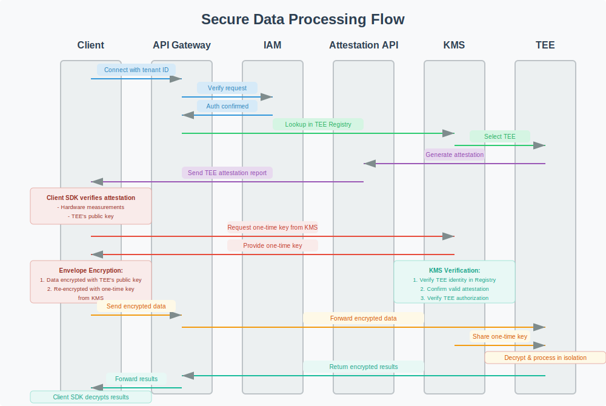

<div align="center">
  <nav>
    <a href="/">Home</a>&nbsp;&nbsp;
    <a href="/pricing.md">Pricing</a>&nbsp;&nbsp;
    <a href="/docs/">Docs</a>
  </nav>
</div>

# Lunal's Security Architecture

## Table of Contents

- [Architectural Overview](#architectural-overview)
- [Security Overview](#security-overview)
- [Integration Tools](#integration-tools)

---

## Architectural Overview

Our platform is built with security at its core, we ensure that customer data is private and secure at rest, in transit, and during compute.

### Key Components

#### API Gateway
- Entry point for all client requests
- Performs initial request validation and client authentication if required
- Routes requests to appropriate TEEs

#### Identity & Access Management
- Authenticates users and services
- Enforces role-based permissions
- Controls access to TEEs and encryption keys

#### Key Management Service (KMS)
- Manages the lifecycle of encryption keys
- Includes integration with attestation API
- Automatically rotates keys based on configurable policies
- Provides secure key storage with HSM protection

#### Attestation Service
- Verifies TEE authenticity and integrity
- Generates cryptographic attestation reports
- performs continuous attestations
- exposes a public attestation API

#### TEE Registry
- Maintains an authoritative list of all legitimate TEEs
- Is part of our KMS as a KV store
- Serves as the source of truth for our TEE ownership validation

#### TEE Infrastructure
- Isolated execution environments for secure processing
- Provides hardware-level security guarantees
- Processes data without exposing unencrypted content

#### Audit Service
- Records all system interactions
- Provides detailed logs for accountability
- Enables security monitoring and compliance

## Security Overview

Lunal's platform employs multiple independent security layers that work together to ensure your sensitive information remains protected at all times.

### Zero Trust Architecture

No part of our infrastructure inherently trusts another. Every component is not trusted by default and must verify itself before interacting with another component or gaining access to sensitive operations or data.

### Defense in Depth

Multiple independent security boundaries protect data, ensuring that no single point of compromise can lead to data exposure.

### TEE Attestation

We issue cryptographically verifiable attestations that both clients and our platform can independently verify. These attestations provide proof of:

- **Hardware Integrity:** Verification that the TEE is running on genuine, unmodified hardware
- **Software Integrity:** Confirmation that the TEE is running authorized code without tampering
- **Identity Validation:** Verification of the TEE's unique cryptographic identity
- **Registry Verification:** Confirmation that the TEE is a legitimate part of our platform

### Multi-layer Encryption

Our platform uses a double envelope encryption approach:

1. **Client Key:** Each client receives a unique client key that identifies them and secures their communication with our platform
2. **Double Envelope Encryption:**
   - First Layer: Data is encrypted with the verified TEE's public key and a client key
   - Second Layer: The already-encrypted data is encrypted again with a one-time key from our KMS and the client's key again.

This approach ensures:

- The client is able to independently verify that it's talking to a legitimate TEE.
- Our platform independently also performs this verification and additionally ensures that this TEE is a legitimate Lunal TEE that is part of our registry.
- For data to be accessed by any TEE, both verifications are required.

### Key Rotation and Lifecycle Management

Security is maintained through comprehensive key management:

- **Automatic Key Rotation:** All encryption keys are rotated on configurable schedules
- **Key Versioning:** Previous key versions are maintained for data accessibility
- **Immediate Revocation:** Keys can be instantly revoked upon security incidents
- **Audit Trails:** Complete logs of all key operations are maintained

### Continuous Attestation and Ephemeral Data

Security doesn't stop after initial verification. Lunal's platform continuously monitors and re-attests all TEEs to ensure ongoing integrity:

### Continuous Attestation
- Every TEE undergoes periodic re-attestation to verify its integrity
- All attestation results are securely logged and available for audit
- Any abnormal measurements trigger automatic key revocation and alerts

### Ephemeral Data Processing
- Data within TEEs exists only temporarily during processing
- A separate data store is used for long term data processing where data is always encrypted at rest and during transit
- Memory state is reset and verified during re-attestation
- Re-attestation provides cryptographic proof of memory state verification

### Transparent Audit Trail
- Every attestation, re-attestation, and TEE interaction is logged
- All key operations are also logged
- Customers can verify the integrity of their processing environments
- Complete audit trails provide evidence for compliance requirements

### Security Flow

Our streamlined security flow ensures data protection throughout the entire process:

### Secure Data Processing Flow



1. **Authentication** (API Gateway & IAM):
   - Client connects with their tenant ID and optional API key
   - API Gateway validates the request format
   - IAM verifies client credentials and permissions

2. **TEE Assignment** (API Gateway & TEE Registry):
   - API Gateway selects an appropriate trusted environment for processing
   - TEE Registry confirms the TEE is available and authorized

3. **Primary Verification** (Attestation API):
   - Attestation API generates an attestation report for the assigned TEE
   - Client receives this attestation which includes:
     - Hardware-based measurements of the TEE
     - TEE's unique public key
     - Cryptographic proof of TEE integrity

4. **Dual-Key Encryption** (Client SDK & KMS):
   - Client SDK verifies the attestation to ensure the TEE is legitimate
   - Client SDK requests a one-time key from our KMS
   - Client SDK performs envelope encryption:
     - First layer: Data is encrypted with the TEE's verified public key
     - Second layer: The encrypted data is encrypted again with the one-time key from KMS

5. **Secondary Verification** (KMS & TEE Registry):
   - KMS verifies the TEE's identity against our TEE Registry
   - KMS confirms TEE attestation is valid via Attestation API
   - KMS verifies TEE is authorized for the tenant's workloads

6. **Secure Key Distribution** (KMS & TEE):
   - Only after both verifications succeed, KMS securely provides the one-time key to the verified TEE
   - TEE can now decrypt the first layer of encryption

7. **Protected Processing** (TEE):
   - TEE decrypts data using its private key and processes it in isolation
   - All operations remain within the protected memory enclave

8. **Results** (TEE & API Gateway):
   - Processed results are encrypted by the TEE
   - API Gateway returns the encrypted results to client
   - Client SDK decrypts and verifies the results

### Fail-Safe Design

Lunal's system is designed to withstand various attack scenarios:

- If a gateway is compromised, requests for key material would be rejected by our independent KMS
- If an attestation service is compromised, our KMS independently verifies TEE identity
- All keys are protected by our KMS, limiting what can be compromised even in worst-case scenarios

## Integration Tools

### Client SDK

We've designed our system for easy integration with your applications:

```javascript
// 1. Initialize the luna client with your tenant ID
// This ID is provided when you sign up for our service
const lunaClient = new LunaClient({
  tenantId: 'your-tenant-id',
  apiKey: 'your-optional-api-key' // Optional for authenticated requests
});

// 2. Send data for secure processing
// Simply specify the job type and your data
// Our SDK handles attestation verification and encryption automatically
const result = await lunaClient.request({
  job: 'your-job-name', // Specifies which processing endpoint to use
  data: yourData // The data to be securely processed
});
```

That's it! Our SDK handles all the complex security operations behind the scenes:

- Authentication using your tenant ID and optional API key
- TEE selection based on your tenant relationship
- Automatic attestation verification to ensure the TEE is legitimate
- Envelope encryption using the TEE's public key and one-time keys
- Secure communication with the TEE

### Verification API

For developers who need programmatic verification of TEE attestations, Lunal provides a dedicated Verification API:

```bash
# Verify a TEE attestation using the API
curl -X POST https://api.lunal.com/v1/attestation/verify \
  -H "Authorization: Bearer your-api-key" \
  -H "Content-Type: application/json" \
  -d '{
    "deployment_id": "your-app-name"
  }'
```

### Example API Response:

```json
{
  "status": "verified",
  "attestation": {
    "id": "att_8f93jd82",
    "timestamp": "2023-09-15T14:32:19Z",
    "deployment_id": "your-app-name",
    "build_hash": "sha256:7a9d2e4cdf81b7d240ae091df166164f6589a444c25ce98649c9452f9fcc1234",
    "measurements": {
      "mr_enclave": "9a6743fc25ed8c83f48d9d453b5ccf8b6239c41ebeda4c5518e5fe33beb89f23",
      "mr_signer": "83d719e77deaca1470f6baf62a4d774303c899db69020f9c70ee1dfc08c7ce9e"
    },
    "signature_verification": {
      "developer_id": "dev_29fja92",
      "signature_valid": true,
      "key_id": "4f:23:98:71:e4:...:35:0a"
    },
    "platform_verification": {
      "tcb_status": "up_to_date",
      "qe_identity_status": "valid"
    }
  }
}
```

Our Verification API enables:

- Independent verification of TEE integrity
- Access to detailed attestation records
- Verification of continuous monitoring results
- Audit trail access for compliance requirements

### Verification CLI

For security teams and administrators, Lunal offers a simple command-line interface for TEE verification:

```bash
# Verify the attestation via CLI
lunal attestation verify --deployment your-app-name
```

### Example CLI Response:

```
✅ Attestation verification complete for deployment: your-app-name

Deployment ID: your-app-name
Build Hash: sha256:7a9d2e4cdf81b7d240ae091df166164f6589a444c25ce98649c9452f9fcc1234
Verification Time: 2025-04-03 22:31:40 UTC

TEE Measurements:
  MR_ENCLAVE: e1b5a493b7f58a72e87e53e7d648edb5fd2801321fc87dd9c58f97c0d027d562
  MR_SIGNER: 6d4bfa5fbd1aa7791c2a75007c9b4f0b4136bb7b89a17bb9a23195c8a53c3690

Developer Signature: VALID ✓
  Developer: John Doe (dev_29fja92)
  Key Fingerprint: 4f:23:98:71:e4:...:35:0a

Platform Verification: SECURE ✓
  TCB Status: Up to date
  QE Identity: Valid
  Memory Encryption: Active
  Secure Boot: Verified

The deployment is running in a genuine TEE environment.
```

The Verification CLI provides:

- Quick security checks for operations teams
- Batch verification capabilities
- Easy integration with security monitoring systems
- Detailed attestation history for auditing purposes

---

[← Back to Documentation](README.md)